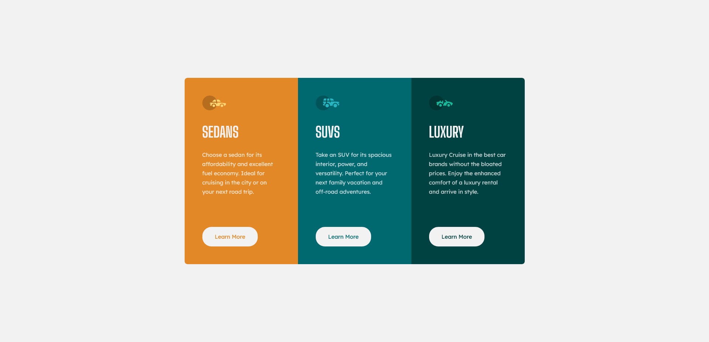
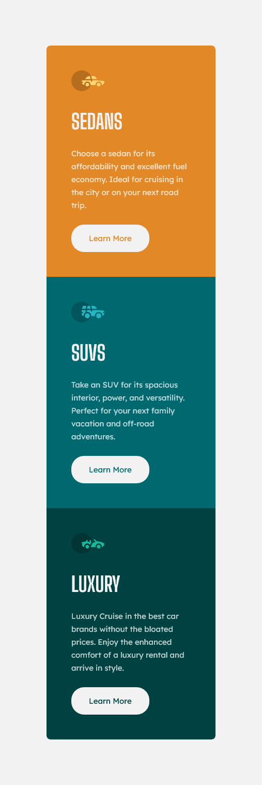

# Frontend Mentor - 3-column preview card component solution

This is a solution to the [3-column preview card component challenge on Frontend Mentor](https://www.frontendmentor.io/solutions/responsive-3column-card-using-css-flexbox-HJC4cPaUc). Frontend Mentor challenges help you improve your coding skills by building realistic projects.

## Table of contents

- [Overview](#overview)
  - [The challenge](#the-challenge)
  - [Screenshot](#screenshot)
  - [Links](#links)
- [My process](#my-process)
  - [Built with](#built-with)
  - [What I learned](#what-i-learned)
  - [Continued development](#continued-development)
- [Author](#author)

## Overview

### The challenge

The challenge is to build out the 3-column preview card component and get it looking as close to the design as possible.

Users should be able to:

- View the optimal layout depending on their device's screen size
- See hover states for interactive elements

### Screenshot

### Links

- Solution URL: [https://www.frontendmentor.io/solutions/responsive-3column-card-using-css-flexbox-HJC4cPaUc](https://www.frontendmentor.io/solutions/responsive-3column-card-using-css-flexbox-HJC4cPaUc)
- Live Site URL: [https://brianyeadon.github.io/3-column-preview-card-component/](https://brianyeadon.github.io/3-column-preview-card-component/)

## My process

Build out for mobile first and then account for desktop through media queries. Finish with QA and a refactor.

### Built with

- Mobile-first workflow
- CSS custom properties
- CSS Flexbox

### What I learned

Added a "sr-only" class to hide the h1 element and learned a little about accessibility in the process.

### Continued development

Learn more about accessibility and semantic HTML.

## Author

- Frontend Mentor - [@brianyeadon](https://www.frontendmentor.io/profile/brianyeadon)
